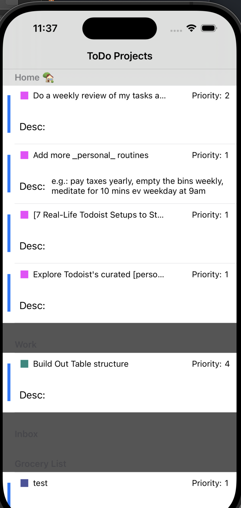

# ToDoist-API-IOS-app

This project was to tie an existing API into an iOS mobile application. This application was built using storyboards inside Xcode while utilizing Swift. Each category has a different bullet point color.This iOS app updates in real time with ToDoist

## Image

